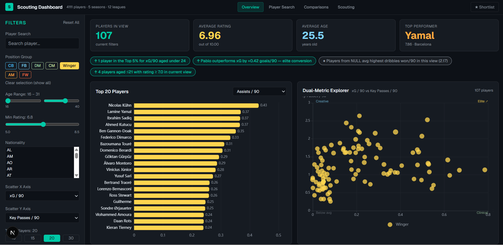
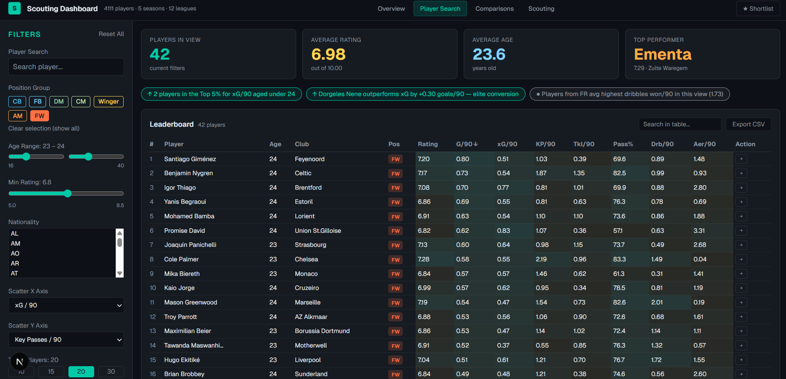
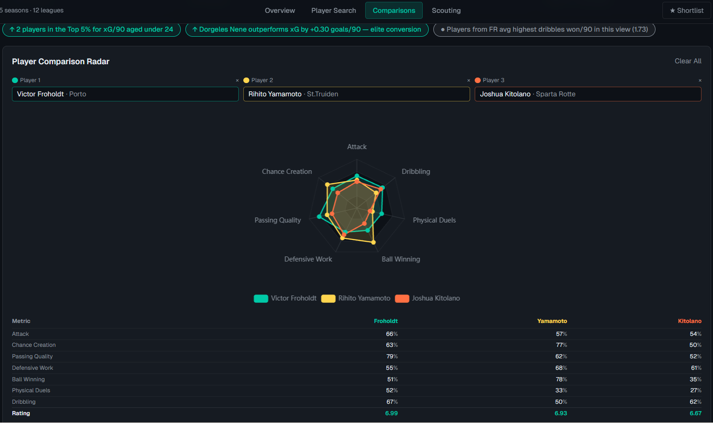
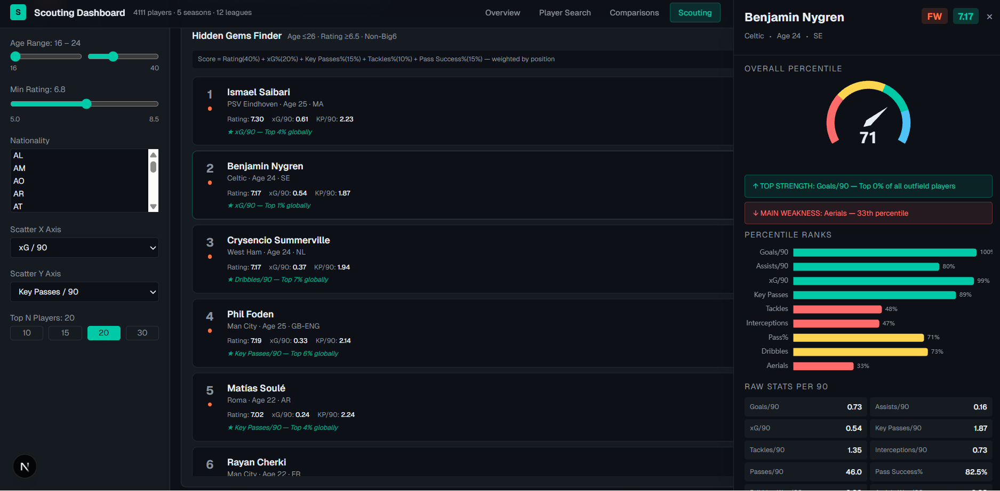

# Football Successor

⚽ **End-to-end football data platform for scouting and player analysis**  
A full-stack project combining **data engineering**, **analytics**, and **interactive product** to support how a club would actually work with performance and recruitment data — from raw inputs to decisions in the UI.

---

## Overview

**Football Successor** is an internal **analytics & scouting studio**: explore player performance, run **like-for-like** and role-based replacement workflows, compare across **leagues and seasons**, and ship those ideas as **usable tools** (not only notebooks).

It is deliberately close to a **real football data office setup**: messy inputs, curated marts, SQL logic for similarity and neighbours, and a front-end that operationalises the analysis for repeated use.

### Documentation (deep dive)

| Doc | Purpose |
|-----|---------|
| [Architecture](docs/ARCHITECTURE.md) | How data, SQL marts, APIs, and UI fit together |
| [Data layout](docs/DATA.md) | Raw inputs, Python loaders, `mart.*` objects |
| [Local setup](docs/LOCAL_SETUP.md) | Environment, Postgres, run & troubleshoot |
| [Contributing](docs/CONTRIBUTING.md) | How to change the repo safely |

---

## End-to-end data pipeline

This project implements a **complete pipeline**:

| Stage | What happens here |
|--------|-------------------|
| **Ingestion** | Raw competition data as **JSON** under `data_raw/` (multi-league / multi-season). |
| **Processing** | **Python** in **`pipelines/`** (Transfermarkt + Supabase loads), **`scripts/`**, and **`artifacts/`** for ETL-style jobs and exports. |
| **Modelling** | **PostgreSQL** analytical layer in a **`mart.*`** schema (dimensions, season pools, merged profiles, memberships, SQL functions). |
| **Serving** | **Next.js API routes** (`web/app/api/*`) exposing queries to the pool — typed handlers, validation, no “magic” in the UI only. |
| **Consumption** | **React dashboards** (“studios”) for L4L, role, development paths, budget fit, upgrades, top metrics, control score, team ranking, **Big 5 season ranking**, scouting, and player detail pages. |

That sequence mirrors how clubs often separate **engineering** (pipelines + marts) from **analytics product** (tools recruiters and analysts live in).

---

## Data pipeline architecture

```
Raw data (JSON / scraped inputs)
        ↓
Python (cleaning, transforms, automation)
        ↓
PostgreSQL (mart.* tables & SQL functions)
        ↓
API routes (Next.js server / Node)
        ↓
Frontend (dashboards, scouting, comparisons)
```

---

## Key features

- **End-to-end ownership** — from raw `data_raw/` inputs through marts to **production-style** UI and APIs.  
- **Analytical marts** — curated tables for scalable player views instead of querying raw chaos ad hoc.  
- **Player comparison & replacement logic** — like-for-like and role workflows powered by **`mart.l4l_metric_weights`**, **`mart.player_position_membership`**, and SQL neighbour / replacement functions under `sql/`.  
- **Interactive dashboards** — multiple studios for different decision questions (fit, budget, upside, team context, etc.).  
- **Cross-league comparability** — e.g. **Big 5** filters, **league strength** coefficients on season metrics, and **cohort normalisation (0–1)** where implemented for transparent ranking.  
- **Single stack** — data engineering, analytics modelling, and **product surface** in one repo a Data Office can actually clone and run.

---

## Screenshots

| Overview — navigation & studios | Player search |
|:---:|:---:|
|  |  |

| Comparisons / studios | Scouting module |
|:---:|:---:|
|  |  |

---

## Technical stack

| Area | Technologies |
|------|----------------|
| **Web** | Next.js 16 (App Router), React 19, TypeScript, Tailwind CSS 4 |
| **Data** | PostgreSQL, analytical **`mart.*`** schema, `pg` connection pooling |
| **Backend** | Next.js **Route Handlers** (Node), JSON metrics from merged / pool tables |
| **Processing** | Python (ETL-style scripts, automation, exports) |
| **Visualisation** | ECharts (where used), custom dashboards, **PapaParse** for CSV scouting flows |
| **Other** | SQL editor–ready mart definitions; artefacts / exports under `artifacts/` when generated |

---

## Data & modelling

Structured layer in PostgreSQL, including (non-exhaustive):

| Object | Role |
|--------|------|
| **`mart.player_dim`** | Player attributes, club, age, market value, position text / tokens. |
| **`mart.player_pool_clean_tbl`** | Season-level **pool** rows (minutes, league, coefficients, wide stats). |
| **`mart.player_profile_merged_v1`** | **Merged** multi-season profile (`*_merged` / p90 / pct columns) for stable comparisons. |
| **`mart.player_position_membership`** | **Bucket** membership for tactical roles (with documented cross-bucket expansion for some L4L flows). |

**SQL in `sql/`** defines marts, weights, and **database functions** for neighbours, replacements, and similar patterns — so the “model” is inspectable, not hidden in app-only logic.

---

## Repository structure

```
Football_Successor_2026/
├── web/                 # Next.js app (UI + API routes)
├── sql/                 # Mart definitions, weights, SQL functions
├── pipelines/           # Python ETL: Transfermarkt + raw→Supabase (see pipelines/README.md)
├── scripts/             # Python utilities (e.g. Power BI helpers)
├── data_raw/            # Raw scraped / competition JSON (large)
├── artifacts/           # Generated outputs (e.g. dashboards) when present
└── docs/screenshots/    # README visuals
```

---

## Example use cases

- **Like-for-like replacements** — weighted metric space, candidate ranking, explainable columns.  
- **Performance across leagues** — pool season rows, league filters, strength-adjusted views where applicable.  
- **Role-specific comparison** — bucket-driven metrics and membership rules.  
- **Scouting workflows** — CSV-driven exploration with filters and charts where implemented.  
- **Team / league context** — ranking and control-style views depending on mart availability.

---

## Running locally

### Requirements

- **Node.js 20+** (LTS)  
- **PostgreSQL** reachable from your machine (e.g. Supabase pooler)

### Setup

```bash
cd web
cp .env.example .env.local
```

Edit **`.env.local`** and set **either**:

- `DATABASE_URL=...` **or**  
- `SUPABASE_DB_URL=...`

(never commit `.env.local` — it stays gitignored).

### Run

```bash
npm install
npm run dev
```

Open [http://localhost:3000](http://localhost:3000).

### Lint (optional)

```bash
npm run lint
```

---

## Deployment

Deployable on **Vercel**, **Railway**, or any **Node** host that supports Next.js. Configure the same database env vars in the host dashboard; watch **connection limits** on pooled Postgres for serverless plans.

---

## Notes on data

- Raw and derived data may be subject to **third-party terms** from your sources — this repo is aimed at **portfolio / demonstration** use unless you add explicit licensing.  
- Large paths under `data_raw/` are intentional for a **realistic** ETL story; clone size reflects that.

---

## Author

**Tomás Baldaque** — [GitHub @TomasBaldaqueDA](https://github.com/TomasBaldaqueDA) · [`football-successor`](https://github.com/TomasBaldaqueDA/football-successor)

---

## O que isto comunica (PT)

- **Produto**, não só um script: há UI, rotas, e decisões de produto em torno de scouting e recrutamento.  
- **Pipeline completo**: ingestão → transformação → mart → API → dashboards.  
- **Contexto de clube**: métricas, posições, ligas, substituições — linguagem que um **Data Office** reconhece logo.

### Impacto para quem abre o repo

Quem for de dados no futebol vê de imediato: **engenharia de dados**, **analytics**, e **contexto desportivo** — no mesmo sítio.
